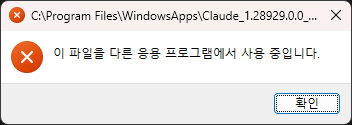

# Claude Desktop Windows Launch Fix

I kept running into this after Claude Desktop updated: the app would not open, and Windows claimed that another program was using a file.



In my case, the useful clue was a group of orphaned `app-server-broker.mjs` processes. Their parent processes were gone, but the brokers were still alive. Stopping Claude's packaged service and removing only those orphaned brokers allowed the AppX container to start again.

This script automates that cleanup. It does not uninstall Claude, reset the app, or delete user data.

## Run it

Open PowerShell and run:

```powershell
.\Fix-ClaudeLaunch.ps1
```

Windows will ask for administrator approval because the script needs to stop `CoworkVMService` and clean up packaged Claude processes.

If your execution policy blocks the script, use:

```powershell
powershell -NoProfile -ExecutionPolicy Bypass -File .\Fix-ClaudeLaunch.ps1
```

## What it does

- Stops `CoworkVMService` without changing its startup type.
- Closes processes running from the Claude MSIX package.
- Finds `app-server-broker.mjs` Node processes whose parent is gone.
- Leaves active brokers and unrelated Node processes alone.
- Waits for the AppX container to settle, then launches Claude.

The script is intentionally narrow. It is meant for the launch failure that produces AppModel-Runtime events `208`/`215` with error `0x80070020`. If no orphaned broker is found, the problem may have a different cause.

This is an unofficial workaround and is not affiliated with Anthropic.
